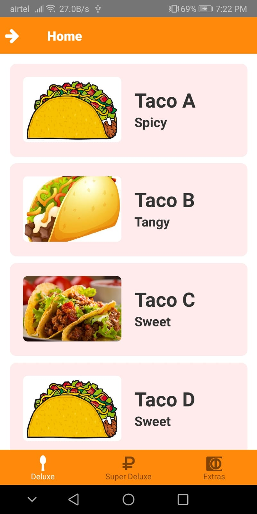
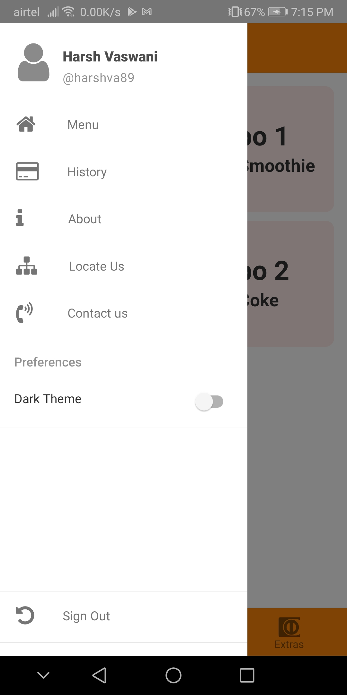
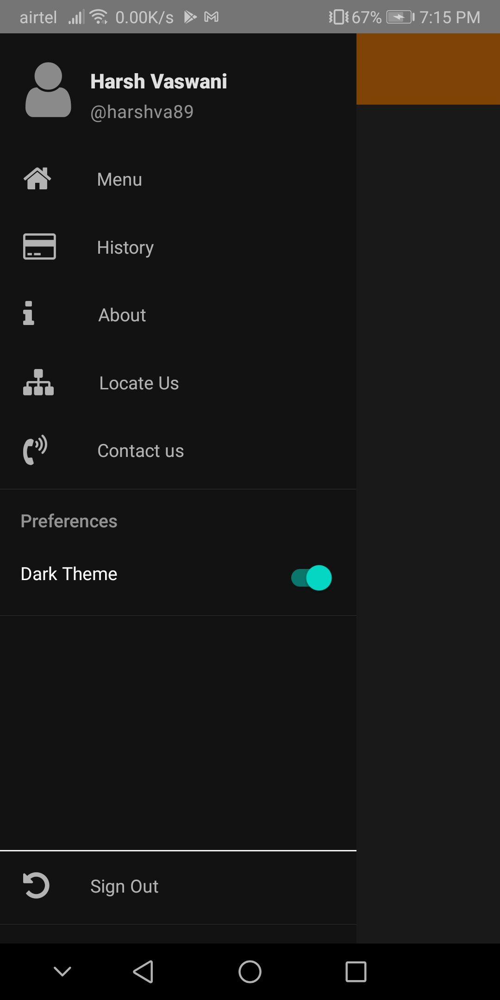
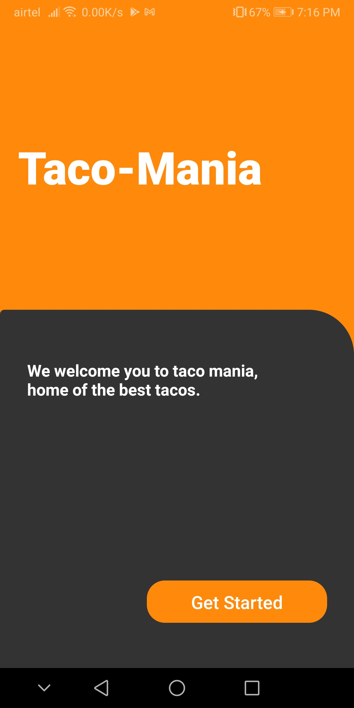
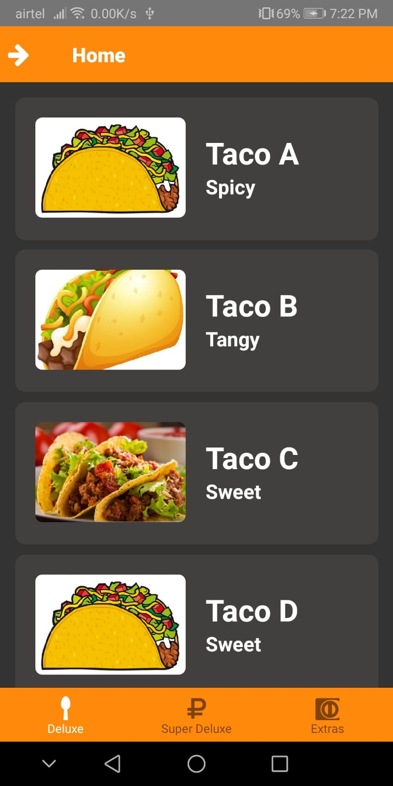
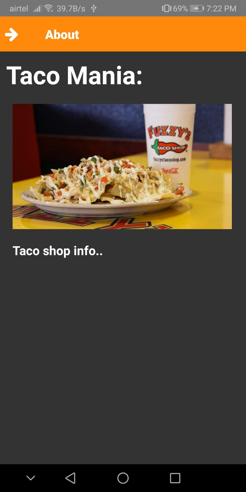

# TacoShop

A simple app to demonstrate a local taco joint on the app. Users can login, view menu, contact or locate stores, etc. This app aims to demonstrate the authentication and navigation features in react-native. Multiple types of navigations like bottom tab and drawer are used here.

Also, implementation of dark theme is implemented to contain both themes, switchable by a switch in drawer.

## Landing and Authentication

 &nbsp; 

## Home and Drawer

 &nbsp;  &nbsp; 

## Dark Theme

 &nbsp; 
  
 &nbsp; 
